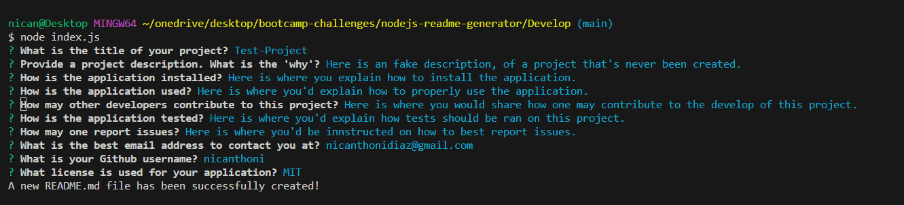
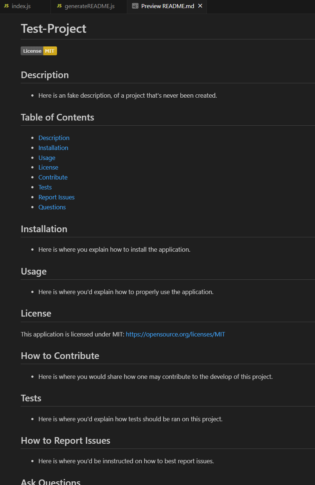
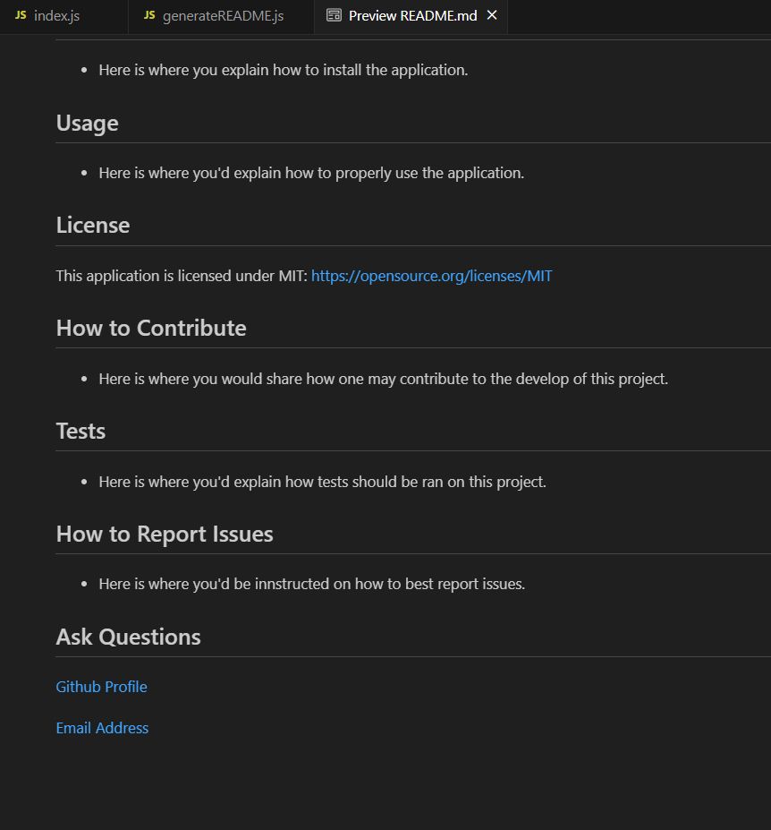

# Nodejs README generator

## Description
* This project exists to utilize nodejs & npm to create a README generator through javascript.

## Screenshots
* Below are screenshot examples of the application in use, and it's functionality:

## Usage
* In your IDE's integrated terminal, open up the index.js file from the Develop folder. Run the application by putting the following command into your terminal: 'node index.js'
Answer the questions asked within the temrinal, by typing a response and pressing enter. When prompted to select a license type, scroll up or down with the arrow keys, and press enter on correct license type. One all answers are provided, looks for a message in the terminal confirming a README file to be successfully created. 

## Ask Questions
[Github Profile](https://github.com/nicanthoni)

[Email Address](nicanthonidiaz@gmail.com)

## License
MIT © [nicanthoni]